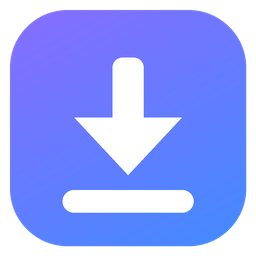
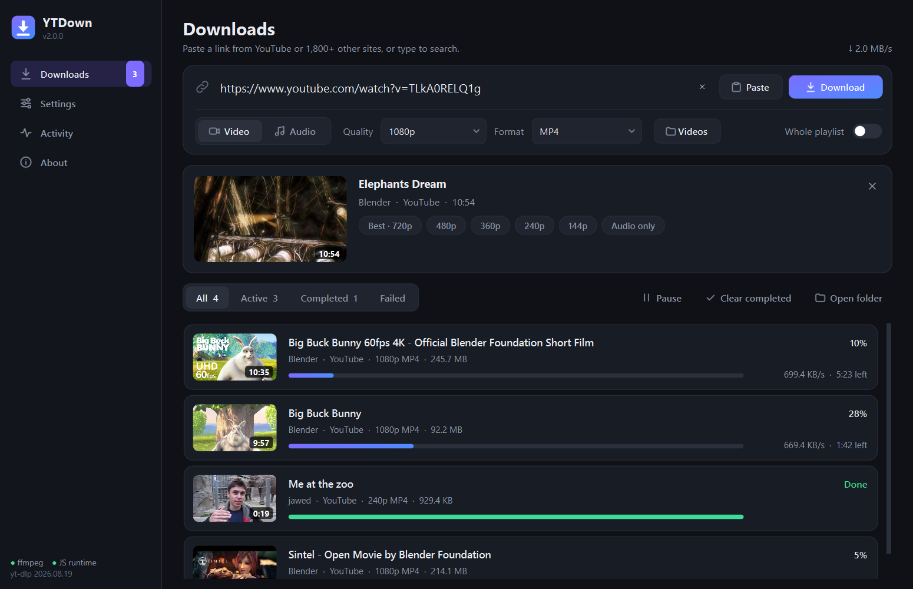
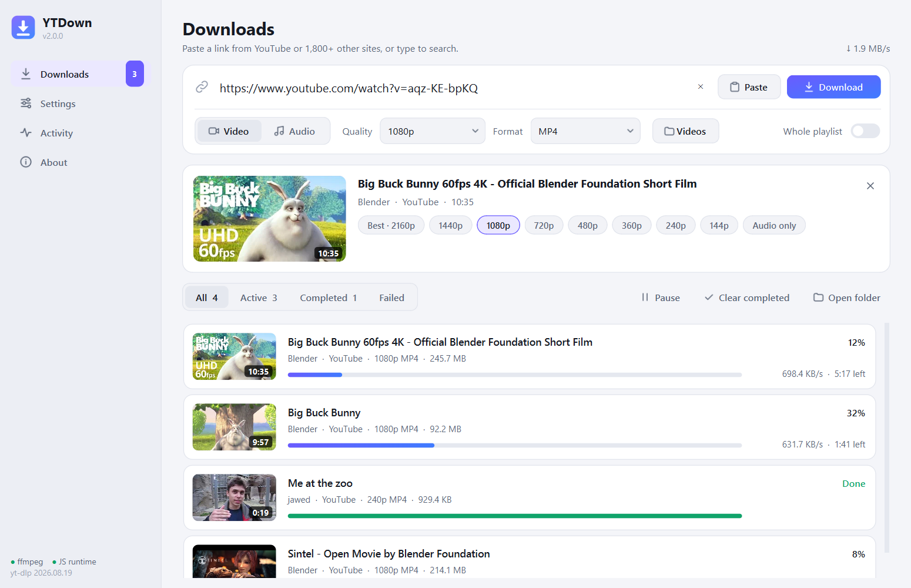
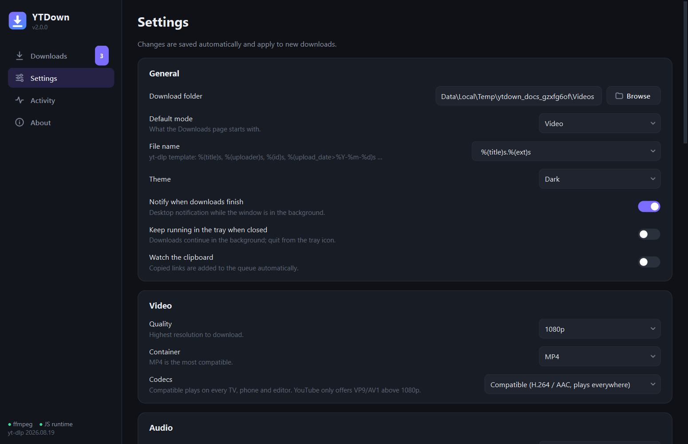

<div align="center">



# YTDown

**A modern, fast video & audio downloader for YouTube and 1,800+ other sites.**

[](https://github.com/ArtfulDodger10/YT_Video_Downloader/actions/workflows/ci.yml)
[](https://github.com/ArtfulDodger10/YT_Video_Downloader/releases/latest)
[](LICENSE)


Paste a link, pick a quality, done. No ads, no accounts, no browser extensions.



</div>

## Features

**Downloading**
- **Preview before you download**: thumbnail, title, channel, length and the qualities that are
  actually available, as one-click chips. Downloads started from the preview begin immediately.
- **Parallel queue** with live progress, speed and ETA; pause, cancel, retry and resume.
- **Playlists & channels** are split into separate items that download in parallel, into a
  numbered folder. Pick just some items (`1-10, 15`).
- **Paste many links at once**, drop them onto the window, or just type words to search YouTube.
- Unfinished downloads are **kept when you close the app** and resumed next time.

**Formats**
- Video in any available resolution (up to 4K/8K) as **MP4, MKV or WEBM**, with a
  *Compatible* mode (H.264/AAC, plays on every TV, phone and editor) or *Best quality* (AV1/VP9).
- Audio as **MP3, M4A, OPUS, FLAC, WAV** or the original stream, with a bitrate choice.
- Cover art, metadata, chapters and **subtitles** embedded automatically.
- **SponsorBlock**: mark or cut sponsor segments from YouTube videos.

**Works where others don't**
- **Signed-in content** (age-restricted, members-only, private shares) using your browser's cookies.
- Proxy, speed limit, retries, optional aria2c.
- Works behind antivirus HTTPS scanning and company proxies (system certificate store).
- Remembers what you downloaded, so re-syncing a playlist only fetches new videos.
- Clear error messages with a **suggested fix** on every failed download.

**Nice touches**
- Dark, light and system themes · tray icon and notifications · clipboard watching ·
  one-click install of missing tools · single-instance · portable mode · a full command line.

<p align="center">
  
  
</p>

## Download

1. Grab **`YTDown-<version>-windows-x64.zip`** from the
   [latest release](https://github.com/ArtfulDodger10/YT_Video_Downloader/releases/latest).
2. Unzip it anywhere and run **`YTDown.exe`**. FFmpeg is already included.
3. For full YouTube quality, install a JavaScript runtime. The app tells you if one is missing
   and installs **Deno** with one click (*About > Install*), or run `winget install DenoLand.Deno`.

> Windows SmartScreen may warn about an unrecognised app because the build isn't code-signed.
> Choose *More info > Run anyway*. You can verify the zip against `SHA256SUMS.txt` in the release.

**Portable mode:** create an empty folder named `portable_data` next to `YTDown.exe` and all
settings and history are stored there instead of your user profile.

### From source (Windows, macOS, Linux)

```bash
git clone https://github.com/ArtfulDodger10/YT_Video_Downloader
cd YT_Video_Downloader
pip install -r requirements.txt
python -m ytdown
```

Requires Python 3.10+, plus [FFmpeg](https://ffmpeg.org/download.html) and
[Deno](https://deno.com/) or Node.js on your PATH.

## Using it

- **Paste** a link (or several) and press **Enter** / **Download**. Typing plain words searches YouTube.
- Pick **Video** or **Audio**, a quality and a format. The choice is remembered.
- In the preview, click a quality chip to pick exactly what the video offers.
- Hover a download for actions (open, show in folder, retry, cancel, remove); right-click for more;
  double-click to play.
- **Settings** has cookies, subtitles, SponsorBlock, file naming, speed and more.

### Command line

The same engine is available headless and uses your saved settings:

```bash
python -m ytdown "https://youtu.be/..."                  # download with saved settings
python -m ytdown -a -f mp3 URL1 URL2                      # audio as MP3
python -m ytdown -q 1080 -f mkv -o D:\Videos URL          # 1080p MKV into D:\Videos
python -m ytdown -I 1-20 -j 4 "https://youtube.com/playlist?list=..."
python -m ytdown "ytsearch3:lofi hip hop"                 # top 3 search results
python -m ytdown --gui URL                                # open (or reuse) the window with URL queued
```

`YTDown.exe` accepts the same arguments.

## FAQ

**Which sites work?** Everything [yt-dlp supports](https://github.com/yt-dlp/yt-dlp/blob/master/supportedsites.md):
YouTube and YouTube Music, Vimeo, TikTok, X/Twitter, Instagram, Facebook, Reddit, Twitch, SoundCloud,
Bandcamp, Dailymotion, Bilibili and many more.

**What about videos that need me to sign in?** Log in with your normal browser, then choose it
under *Settings > Network > Cookies from browser* (Firefox works best; close Chrome/Edge first),
or use a `cookies.txt` export. YTDown never asks for your password.

**Netflix, Spotify, Disney+…?** No. DRM-protected services are not supported.

**A site stopped working.** Sites change often. Use *About > Update yt-dlp* (source installs) or
download the latest release, which always ships the newest yt-dlp.

**Downloads fail with "certificate verify failed".** Keep *Use the system certificate store* on
(the default on Windows); it's caused by antivirus HTTPS scanning or a company proxy.

## Building

```powershell
.\build.ps1                                   # dist\YTDown\YTDown.exe
.\build.ps1 -WithFfmpeg C:\ffmpeg\bin -Zip    # + bundled FFmpeg + release zip
.\build.ps1 -OneFile                          # single-file exe (starts slower)
```

Releases are built automatically by GitHub Actions when a `v*` tag is pushed.

## Contributing

Bug reports and pull requests are welcome. See [CONTRIBUTING.md](CONTRIBUTING.md). Run the
checks with `ruff check .` and `pytest` (the tests are offline and take about half a minute).

## Credits & license

YTDown is MIT-licensed ([LICENSE](LICENSE)). It stands on the shoulders of
[yt-dlp](https://github.com/yt-dlp/yt-dlp), [FFmpeg](https://ffmpeg.org/) and
[Qt for Python](https://doc.qt.io/qtforpython/). See [THIRD_PARTY_NOTICES.md](THIRD_PARTY_NOTICES.md).

**Only download content you own or have permission to download, and respect each site's terms of service.**
